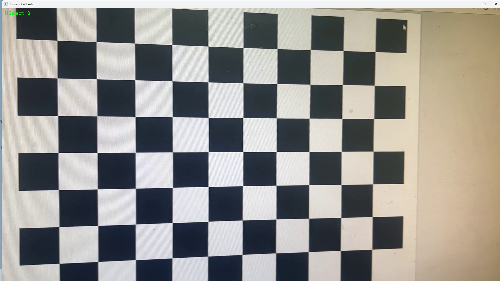
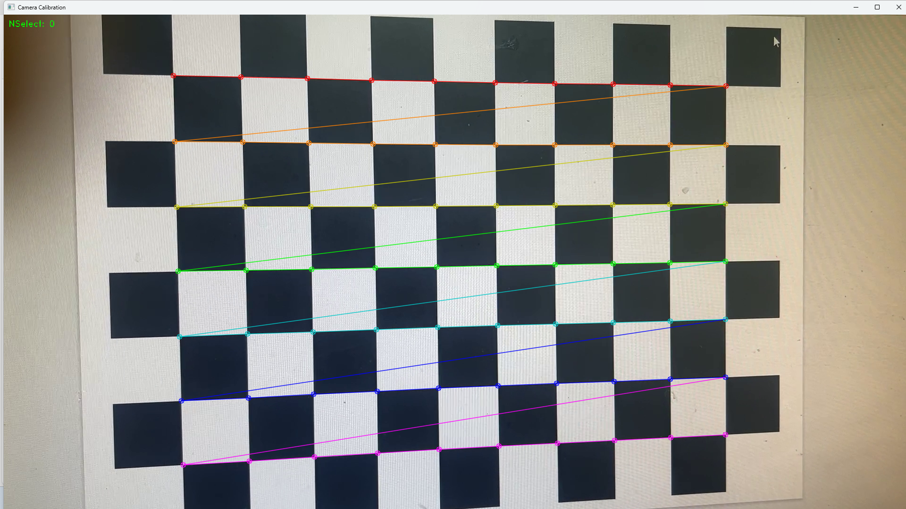
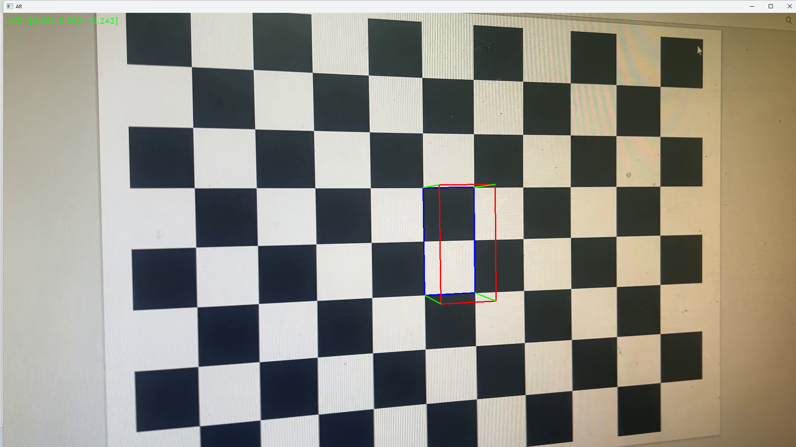

# Camera Pos Estimate
자신의 카메라를 캘리브레이션 하고 위치를 계산하는 프로그램

## Requirement
체스보드를 검출할 수 있는 영상이 필요해요

## Usage
프로그램을 실행시키면 자신이 선택한 영상이 재생됩니다. 이때 Space키를 눌러 멈출 수 있고, 다시 Space키를 누르면 영상이 다시 재생됩니다.

최초 실행시 화면

Space 키를 눌러 재생을 멈춘 화면

재생이 멈췄을 때 Enter키를 누르면 캘리브레이션을 위해 그 프레임을 저장합니다.

영상이 모두 재생되거나 ESC키를 눌러 종료하면 카메라 캘리브레이션 결과를 콘솔창에 출력합니다.
이후 다시 영상이 처음부터 재생됩니다. 이때 자신의 카메라 자세가 오른쪽 상단에 출력됩니다.

영상이 재생되면서 체스보드 위에는 AR물체가 같이 표시되어집니다.
영상에 표시되는 AR물체는 main.py의 78-79번째 줄 lower와 upper변수를 수정해 바꿀 수 있습니다. 
np.array형식의 이 변수는 영상속 체스보드의 격자점 좌표를 나타냅니다.
lower변수는 파란색. upper변수는 빨간색으로 나타납니다.